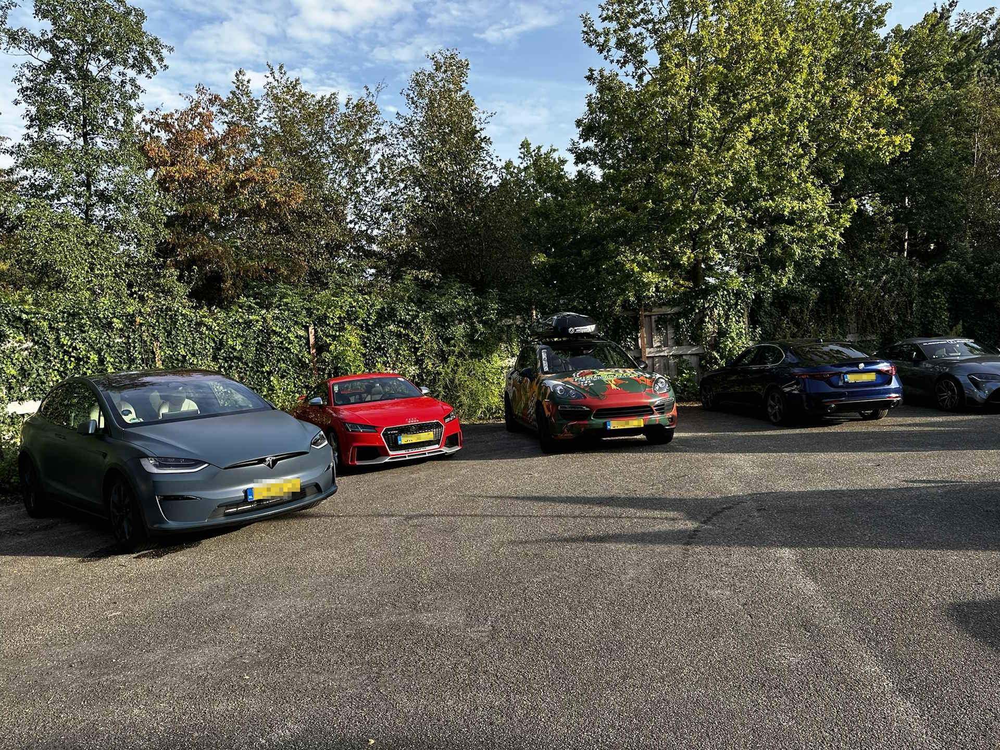

**(Dutch content)** Zaterdag 7 oktober was ik bij CenterParcs de Eemhof in Zeewolde voor mijn allereerste bijdrage als vrijwilliger op de opkikkerdag!

<!--more-->

[Stichting de Opkikker](https://opkikker.nl) organiseert regelmatig opkikkerdagen, voor kinderen en hun gezin die wel een opkikker kunnen gebruiken. Bij dit evenement in Zeewolde zijn vijftig gezinnen uitgenodigd voor wie een hele dag lang een gaaf activiteitenprogramma is opgesteld met o.a. helicopter vliegen, schminken, rondrijden in een limosine, trike of sportwagen, rijden in een koets of allerlei andere leuke activiteiten.

Ik was erg onder de indruk van de professionele organisatie en de vele vrijwilligers welke de gezinnen een prachtige dag hebben bezorgd. Naast de landmacht was ook politie en brandweer aanwezig voor de kinderen en hun gezin. Met de Tesla heb ik veel rondritten kunnen doen. Hopelijk heeft iedereen genoten en ik ben blij dat ik een steentje heb kunnen bijdragen! 