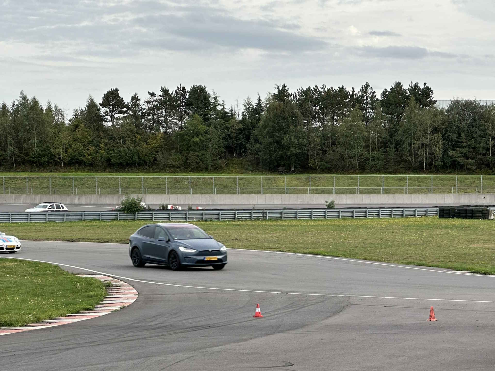

**(Dutch content)** Een druk weekeinde, wat na de opkikkerdag in Zeewolde was het de volgende dag direct door naar de circuitdag van [Stichting Dag met een Lach](https://dagmeteenlach.nl). Op deze dag zijn ongeveer honderd kinderen met hun begeleiders uitgenodigd om de zorgen even te vergeten en een leuke dag te hebben. 

Aan de laatste keer op het circuit in Meppen, Duitsland, hebben we minder goede ervaringen: De Tesla moest worden afgesleept naar wat later bleek een kapotte wielnaaf door losgetrilde wielmoeren. Dit keer is alles heel gebleven en veel kinderen een leuke rit kunnen bezorgen. En ja, de Tesla accelereert echt sneller dan een Lamborghini :-) Aan het einde van de middag gezellig afgesloten met een barbeque.

 






We kijken terug op een geslaagd event en hopen volgend jaar weer veel kinderen een grote lach op het gezicht te mogen bezorgen!  
