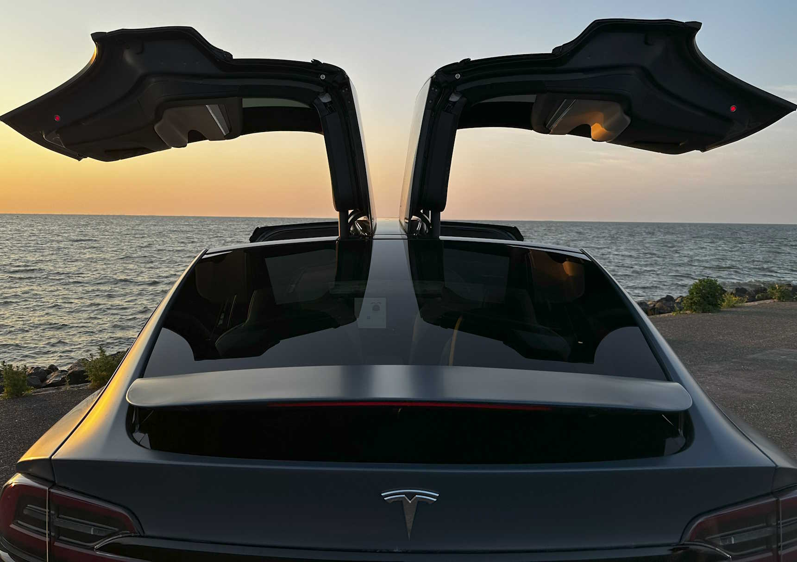

Finally, dreams come true, I am the proud owner of a Tesla Model X Plaid! After waiting more than two years, I got an SMS from Tesla the car could be picked up from the Tesla Delivery Center in Tilburg, The Netherlands on March, 23rd.

The X was ordered in November 2021. This was just before the Model X 'refresh' was announced. Tesla stopped production of the Model X in the Fremont factory to prepare for the refresh. It took some months before production was started, and the rumor was the X would be assembled in the new, yet-to-built, European Gigafactory in Berlin, Germany. This was delayed several times and with also the computer chip shortage, the 'special operation' in Ukraine, and other reasons unknown, I finally got an SMS if I was still interested in buying the Model X. Please respond within 20 hours or your order will be canceled...       

 






The car was on my bucket list for several years and I am extremely happy that checkbox can be ticked.  The Model X has only five colors: white, black, grey, blue, and red. I ordered white and wrapped it with the 3M Thundercloud satin color.  It has six seats and I choose cream as the interior color. I like Tesla for the Full Self Driving (FSD) features and I cannot wait until this is available in Europe.

It will be my daily drive and I want to attend several charity events to drive children at special events. The Tesla Model X Plaid is known for its exceptional performance and acceleration. It can go from 0 to 100 km/h in 2.6 seconds, providing an exhilarating driving experience. It is faster than most Ferraris, Lamborghinis, or Porsches. Also, the falcon-wing doors are an eyecatcher.









