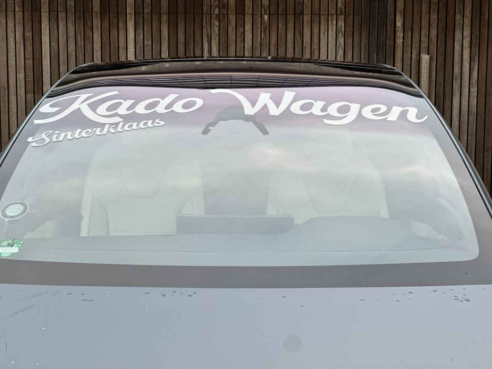

Van de [Tesla Wensrit](https://teslawensrit.nl) organisatie kwam het verzoek om Sint en Piet te vervoeren voor een bezoek aan de basisschool de Meander in Lelystad. Al snel waren vier Tesla's bij elkaar om Sint, de pieten, de kado's en strooigoed te vervoeren.

Wat begon met even Sint en Piet naar een basischool brengen, liep al snel uit tot een hele organisatie met overleg, uitsnijden van stickers en het beplakken van de Tesla's! Tijdens het overleg werd geroepen dat het ook wel een leuk idee was om de auto's te bestickeren. Nu heb ik toevallig een snijplotter, dus voor ik het wist zat ik de letters te ontwerpen, werd er folie aangeleverd, stickers geplot, uitgesneden en op de auto's geplakt.

#
#
#

Ik heb wel geleerd wat het verschil is tussen spiegelschrift en gewoon schrift ;-) Het was erg leuk en gezellig om het te doen en de kinderen vonden het fantastisch. Vooral de frunk gevuld met pepernoten viel goed in de smaak!

#
#
#
#
#

