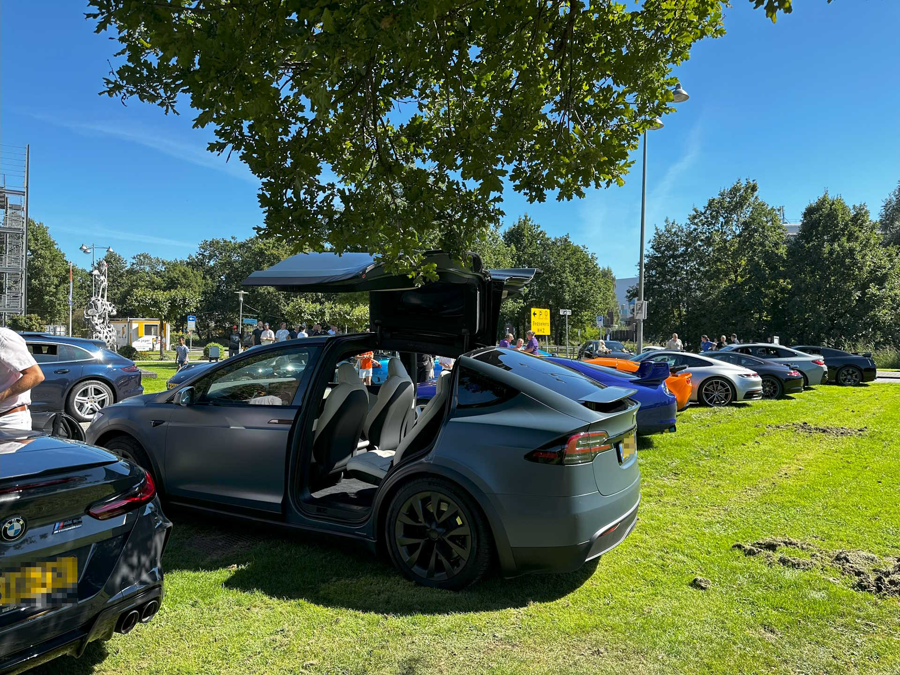

**(Dutch content)** Vanuit Stichting Dag met een Lach kwam het verzoek of we willen assisteren om patientjes van het Wilhelmina Kinderziekenhuis op woensdag 6 september 2023 een hele mooie middag kunnen bezorgen. 

Op deze prachtige nazomerse middag hebben zich ongeveer twintig sportwagens verzameld voor de ingang van het Wilhelmina Kinderziekenhuis in Utrecht om vanaf daar een aantal rondritten te maken. Met de Tesla een aantal rondritten gemaakt en patientjes met hun familie een leuke dag kunnen bezorgen. 

De middag stond ook in het teken om aandacht te vragen voor CF, Cystic Fibrosis. Op de website van [Muco and Friends](https://mucofriends.com) is meer informatie hierover te vinden.  

***

