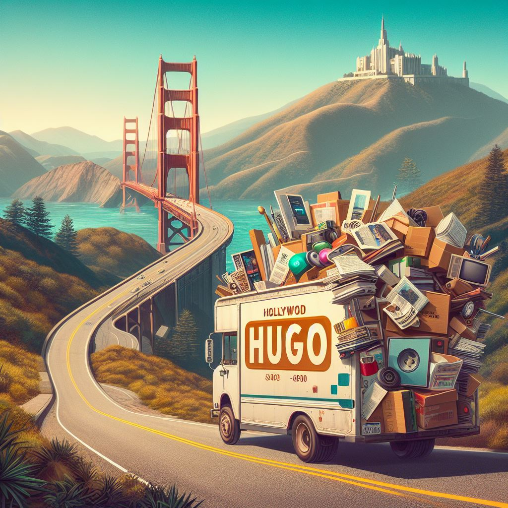

With a new blog post about moving to the Hugo static website generator, a new image with this blog is also needed. But how do I create or find this image?



Artifical Intelligence to the rescue! 


```
create a photorealistic 16:9 format picture with a curvy road from bottom left to upper right in a scenic landscape. On the upper right is a dark dense industrial city with chimneys. On the lower left is a sunny, organized, futuristic city with a beach and green trees. On the road is a long mover van with a lot of papers, pictures, car parts, and computer stuff. The van has a big sign with the name of 'HUGO'
```


create a photorealistic long mover van with a lot of papers, pictures, car parts, and computer stuff. The van has on top a big sign called 'HUGO' hollywood style.












https://designer.microsoft.com/home


A photorealistic scenic landscape with a bridge, a single curvy road, and mountains. Add Hollywood sign called 'HUGO'. On the road is a porsche mover van, piled with articles, magazines, photos, car parts, and computer stuff. 
A scenic landscape with a bridge, a single curvy road, and mountains. Add 'HUGO' as a Hollywood sign. On the road is a mover van, piled with articles, magazines, photos, car parts, and computer stuff. 