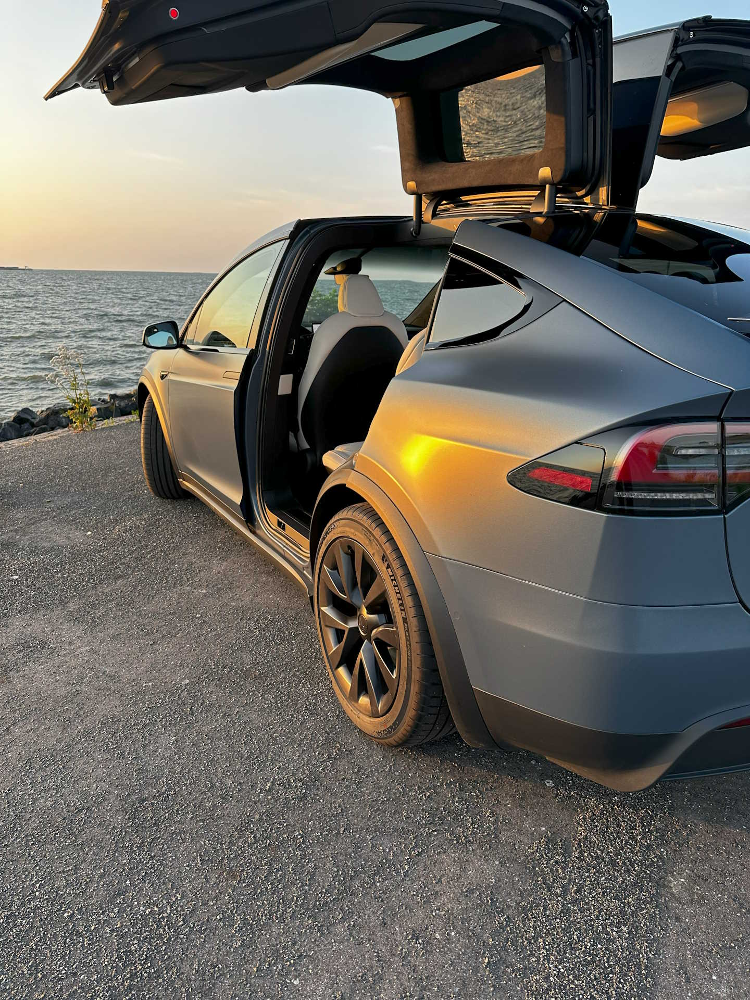
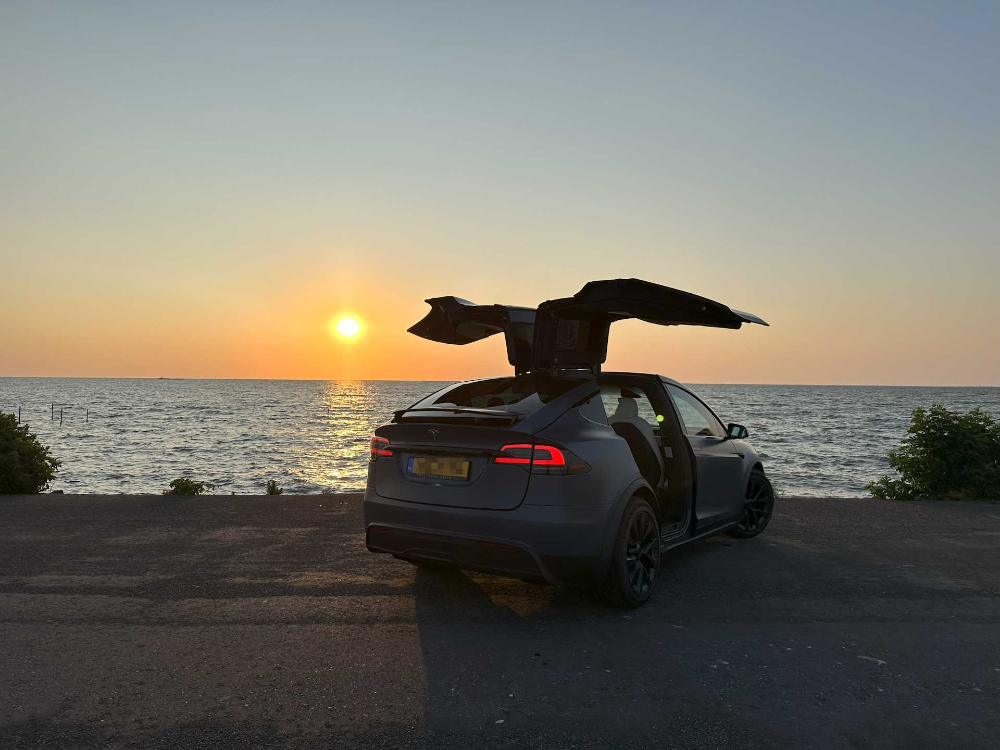
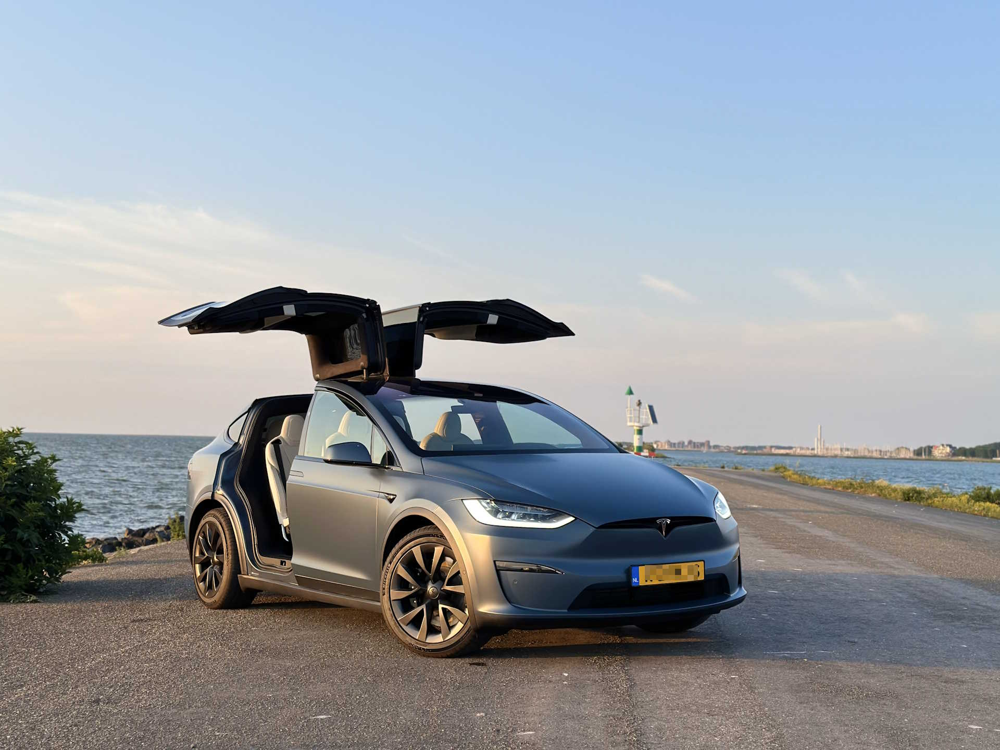

Finally, dreams come true, I am the proud owner of a Tesla Model X Plaid! After waiting more than two years, I got an SMS from Tesla the car could be picked up from the Tesla Delivery Center in Tilburg, The Netherlands on March, 23rd.

The car was on my bucket list for several years and I am extremely happy that checkbox can be ticked.  The Model X has only five colors: white, black, grey, blue, and red. I ordered white and wrapped it with the 3M Thundercloud satin color.  It has six seats and I choose cream as the interior color. I like Tesla for the Full Self Driving (FSD) features and I cannot wait until this is available in Europe.

It will be my daily drive and I want to attend several charity events to drive children at special events. The Tesla Model X Plaid is known for its exceptional performance and acceleration. It can go from 0 to 100 km/h in 2.6 seconds, providing an exhilarating driving experience. It is faster than most Ferraris, Lamborghinis, or Porsches. Also, the falcon-wing doors are an eyecatcher.

